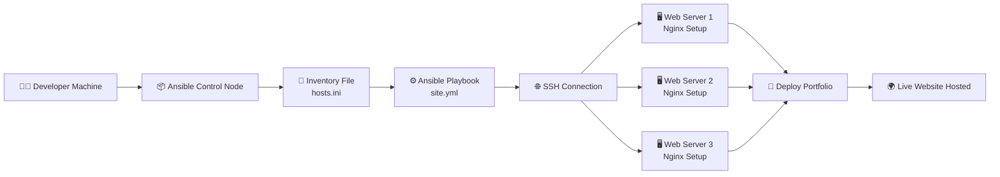

🧑‍💻 Ansible Project – Automated Portfolio Deployment

This project automates the deployment of my personal DevOps portfolio using Ansible — making the setup consistent and repeatable across multiple servers.

🚀 What It Does

Configures Nginx web servers

Deploys static portfolio website files

Manages multi-server environments (Prod, Dev, Staging)

Integrates with Terraform for infrastructure provisioning

🧰 Tech Used

Ansible

Nginx

Ubuntu / AWS EC2

Terraform

⚙️ How to Run
1️⃣ Install Ansible

Run the following commands on your control node (local or EC2 instance):
--sudo apt update
--sudo apt install ansible -y

To verify installation:

ansible --version

Configure the Inventory (hosts) File

Create or edit your inventory file (for example: inventory/hosts.ini):

[webservers]
server1 ansible_host=3.142.52.119 ansible_user=ubuntu ansible_ssh_private_key_file=~/.ssh/your-key.pem
server2 ansible_host=xx.xx.xx.xx ansible_user=ubuntu ansible_ssh_private_key_file=~/.ssh/your-key.pem
server3 ansible_host=xx.xx.xx.xx ansible_user=ubuntu ansible_ssh_private_key_file=~/.ssh/your-key.pem

## ⚙️ How to Run
bash
ansible-playbook playbooks/site.yml 

